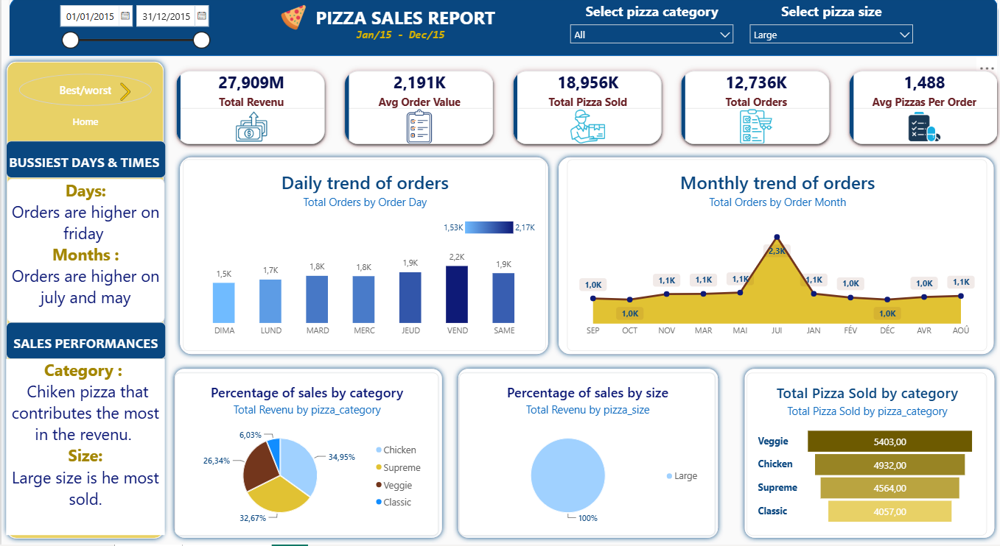
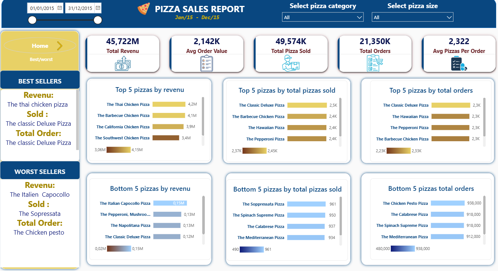

# 🍕 Pizza Sales Analysis — Power BI & SQL

An end-to-end sales analysis of a pizza restaurant's 2015 orders. The raw data is explored with **SQL Server** to define the KPIs and chart requirements, then visualised in an interactive **Power BI** dashboard.

---

## 📌 Project Overview

The goal is to turn ~48K order lines into clear answers to business questions:

- How much revenue did we make, and how many pizzas and orders does that represent?
- Which days and months are the busiest?
- Which pizza categories and sizes drive sales?
- Which pizzas are the best and worst sellers?

## 🖼️ Dashboard Preview

### Page 1 — Overview (Home)



Shows the headline KPIs, the daily and monthly order trends, and the split of sales by category and size. *(The screenshot above has the size slicer set to "Large".)*

### Page 2 — Best / Worst Sellers



Ranks the top 5 and bottom 5 pizzas by revenue, total pizzas sold, and total orders.

---

## 📊 KPIs

| KPI | Definition |
|---|---|
| **Total Revenue** | Sum of `total_price` across all orders |
| **Average Order Value** | Total revenue ÷ number of distinct orders |
| **Total Pizzas Sold** | Sum of `quantity` |
| **Total Orders** | Count of distinct `order_id` |
| **Avg Pizzas per Order** | Total pizzas sold ÷ total orders |

## 🔍 Key Insights

- **Busiest day:** Friday has the highest number of orders.
- **Busiest months:** Orders peak in the summer months, with a clear spike compared with the rest of the year.
- **Top category by revenue:** Chicken pizzas contribute the most revenue (~35%), followed by Supreme, Veggie and Classic.
- **Best sellers:** The Thai Chicken Pizza leads in revenue, while The Classic Deluxe Pizza leads in both pizzas sold and total orders.
- **Worst sellers:** The Italian Capocollo (revenue), The Soppressata (pizzas sold) and The Chicken Pesto (orders) sit at the bottom.

> Figures come from the dashboard screenshots; check the `.pbix` file for the values under each filter selection.

## 🛠️ Tools & Skills

- **SQL Server (T-SQL):** KPI and chart queries (`SUM`, `COUNT DISTINCT`, `GROUP BY`, `DATENAME`, `TOP`, casting to avoid integer division)
- **Power BI:** data modelling, DAX measures, interactive slicers (date range, pizza category, pizza size), page navigation buttons, custom-themed visuals
- **Data storytelling:** turning raw transactions into an actionable report

## 📁 Repository Structure

```
├── images/                                      # Dashboard screenshots used in this README
├── Pizza Sales Images/                          # Icons used in the dashboard
├── pizza_sales.csv                              # Raw dataset (48,620 rows)
├── pizza_sales_excel_file.xlsx                  # Excel version of the dataset
├── SQLQuery1.sql                                # SQL queries for KPIs and charts
├── Pizza_sales_analysis_dashboards.pbix         # Power BI report
├── Pizza_sales_analysis_dashboards_template.pbit# Power BI template
└── README.md
```

## 🗃️ Dataset

`pizza_sales.csv` contains one row per pizza line item with these columns:

`pizza_id`, `order_id`, `pizza_name_id`, `quantity`, `order_date`, `order_time`, `unit_price`, `total_price`, `pizza_size`, `pizza_category`, `pizza_ingredients`, `pizza_name`

## 🚀 How to Run

1. Clone or download this repository.
2. **SQL:** import `pizza_sales.csv` into SQL Server as a table named `pizza_sales` in a database called `Pizza_db`, then run `SQLQuery1.sql`.
3. **Power BI:** open `Pizza_sales_analysis_dashboards.pbix` in Power BI Desktop. If you use the `.pbit` template, point the data source to your local `pizza_sales.csv` when prompted.

## 👤 Author

**Your Name** — [LinkedIn](https://www.linkedin.com/) · [GitHub](https://github.com/)
